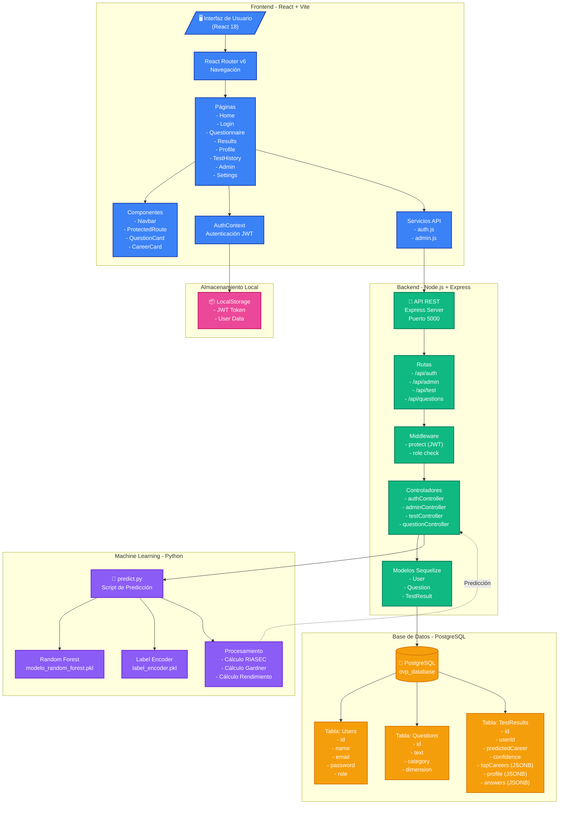
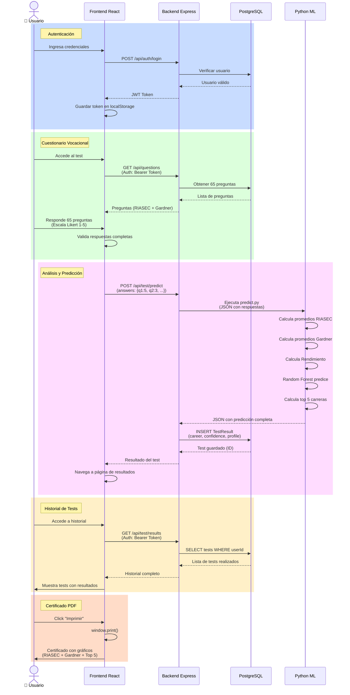
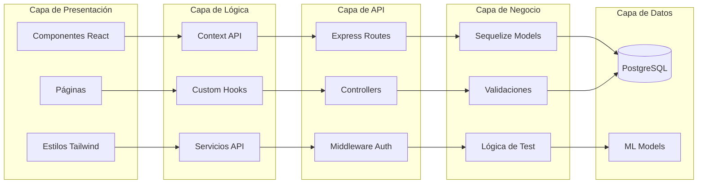
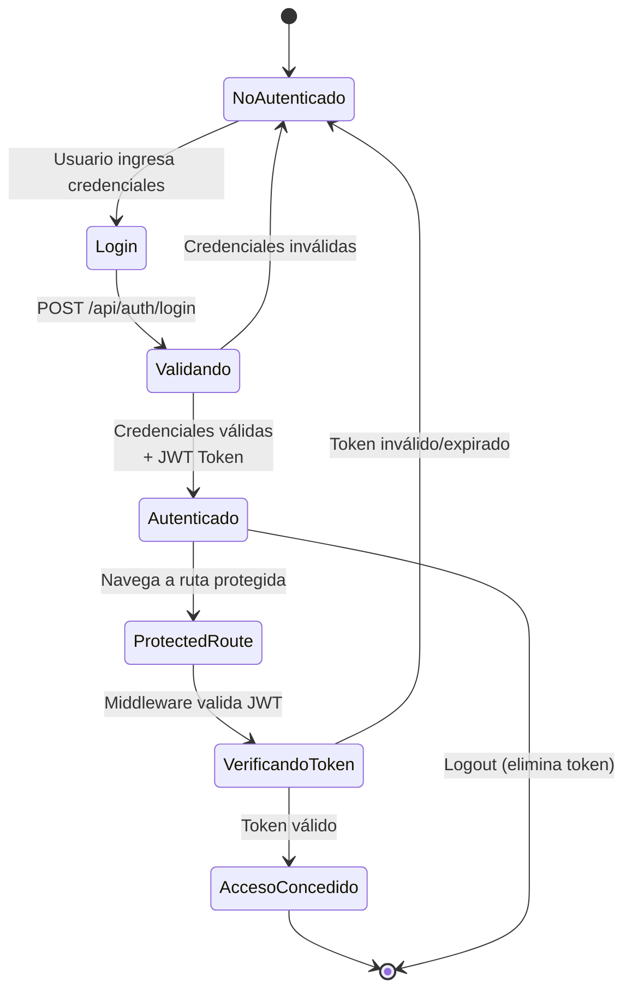
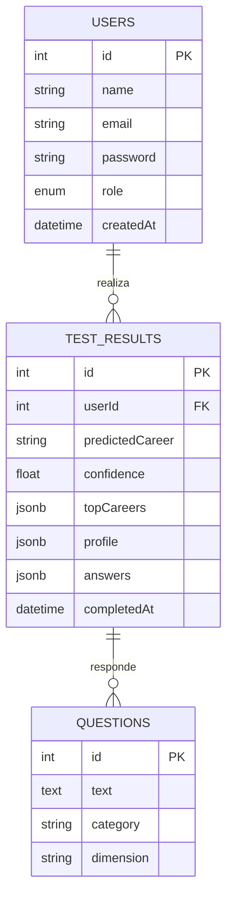
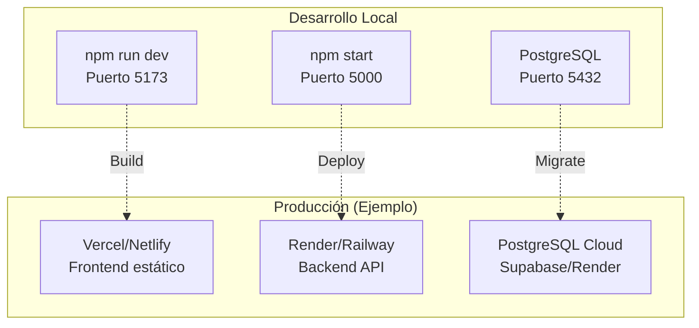

# Arquitectura del Sistema OVP (Orientación Vocacional Profesional)

## Diagrama de Arquitectura



## Flujo de Datos Principal



## Arquitectura de Capas



## Tecnologías Utilizadas

### Frontend
- **React 18** - Framework UI
- **Vite** - Build tool y dev server
- **React Router v6** - Navegación SPA
- **Tailwind CSS** - Estilos utility-first
- **Heroicons** - Iconos SVG
- **Axios** - Cliente HTTP

### Backend
- **Node.js** - Runtime JavaScript
- **Express.js** - Framework web
- **Sequelize** - ORM para PostgreSQL
- **JWT** - Autenticación basada en tokens
- **bcryptjs** - Hash de contraseñas
- **cors** - Cross-Origin Resource Sharing
- **dotenv** - Variables de entorno

### Machine Learning
- **Python 3.13.4** - Lenguaje de programación
- **scikit-learn** - Random Forest Classifier
- **pandas** - Manipulación de datos
- **numpy** - Operaciones numéricas
- **joblib** - Serialización de modelos

### Base de Datos
- **PostgreSQL** - Base de datos relacional
- **JSONB** - Almacenamiento flexible de resultados

## Flujo de Autenticación



## Estructura de Datos del Test



## Modelo de Datos JSONB

### topCareers (Array)
```json
[
  {
    "carrera": "Ingeniería de Software",
    "porcentaje": 85.5
  },
  {
    "carrera": "Ciencias de la Computación",
    "porcentaje": 82.3
  }
]
```

### profile (Object)
```json
{
  "R": 3.4,
  "I": 4.2,
  "A": 2.8,
  "S": 3.6,
  "E": 3.9,
  "C": 3.1,
  "LM": 4.5,
  "L": 3.8,
  "ES": 4.0,
  "M": 2.5,
  "CK": 3.2,
  "IP": 3.7,
  "IA": 4.1,
  "N": 3.3,
  "Rendimiento_General": 4,
  "Rendimiento_STEM": 5,
  "Rendimiento_Humanidades": 3
}
```

### answers (Object)
```json
{
  "q1": 4,
  "q2": 5,
  "q3": 3,
  "...": "...",
  "q65": 4
}
```

## Despliegue



## Seguridad

- ✅ JWT con expiración configurable
- ✅ Passwords hasheados con bcrypt
- ✅ Validación de roles (admin/student)
- ✅ Protected routes en frontend y backend
- ✅ CORS configurado
- ✅ Variables de entorno para secretos
- ✅ SQL injection prevention (Sequelize ORM)

## Escalabilidad

- ✅ Stateless API (JWT)
- ✅ JSONB para datos flexibles
- ✅ Connection pooling en PostgreSQL
- ✅ Modelo ML pre-entrenado (rápido)
- ✅ Frontend SPA optimizado con Vite
- ✅ Componentes React reutilizables

---

**Fecha de Documentación**: Noviembre 2025  
**Versión del Sistema**: 1.0.0
